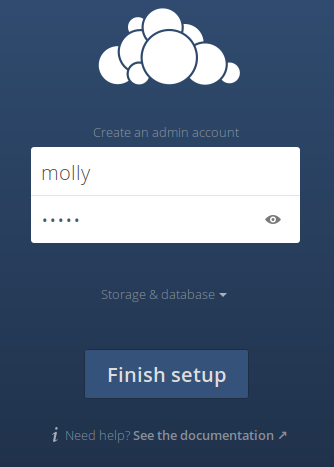

# 2 - Installation with the Linux Package Manager

The quickest and easiest way to install ownCloud on Linux is to use the Open Build Service packages (see Linux Package Manager Installation). These are maintained by ownCloud engineers, and you can use your package manager to keep your ownCloud server up-to-date.

The recommended package to use is `owncloud-files`, which only installs ownCloud; it does not install any LAMP elements.

1. Install your own LAMP stack, to create your own custom LAMP stack without dependency conflicts with the ownCloud package.

2. Update package manager’s configuration. Configurations are available for the Linux distributions listed inSystem Requirements, apart from Fedora and openSUSE Tumbleweed.

3. Follow the rest of the instructions on the download page to install ownCloud. 

4. Run the Installation Wizard to complete your installation.

## The Installation Wizard

**CAUTION** Before using the Installation Wizard, you should protect it with password authentication or access control. If left unprotected, a malicious actor could finish the installation and block you out.

When all ownCloud files are installed, the last step to completing the installation is running the Installation Wizard using the following steps:

1. Point your web browser to http://localhost/owncloud

2. Enter your desired administrator’s username and password.

3. Click **Finish Setup**.

You can now start using your new ownCloud server. However, you can do much more to set up the server for best performance and security. For important installation and post-installation steps, see the **In-Depth Guide** in the [Installation Wizard](https://doc.owncloud.org/server/10.0/admin_manual/installation/installation_wizard.html) section of the *Admin Guide*. 

## Manual Installation on Linux

You can setup ownCloud from scratch using a classic LAMP stack (Linux, Apache, MySQL/MariaDB, PHP). Go to the [Manual Installation on Linux](https://doc.owncloud.org/server/10.0/admin_manual/installation/source_installation.html) section in the Admin Guide. This walks you through installing ownCloud on Ubuntu 14.04 LTS Server with Apache and MariaDB, using the ownCloud .tar archive.

----
Go back to [Welcome](owncloud_qs_intro.html) or move on to [Configuration](owncloud_qs_s3.html)
