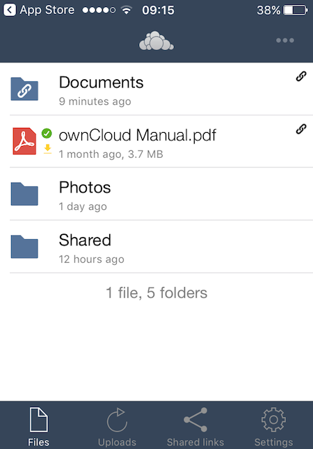

# 5 - Connecting with a Desktop or Mobile Client

You can share files and folders on your computer, and synchronize them with your ownCloud server. When you place files in your local shared directories, those files are immediately synchronized to the server and to other devices using the ownCloud Desktop Sync Client, Android app, or iOS app. This means you can always access those files when travelling with your laptop or mobile phone.

ownCloud provides a desktop client for Windows, Macs, and Linux computers, and mobile apps for Android and iOS.

## Using the ownCloud iOS App
The ownCloud iOS app offers some nice advantages over the alternative Web interface. It provides automatic synchronization of your files, and shares them with other ownCloud users. It has an interface optimized for iPhone and iPad, and enables easy uploading of files. It also has an optional PIN for stronger security.

### Getting the ownCloud iOS App
It's very easy to install and use the ownCloud iOS app.

1. Open Safari, or any Web browser, and point it to your ownCloud server.
2. Log in and look on your Personal page for a link to the ownCloud app on iTunes.
3. Install the ownCloud app and open it
4. Enter your ownCloud server URL and login.

When it connects, it opens to your Files page.

### Desktop Client
For information on the Desktop Client, go to the [ownCloud Desktop Client Manual](https://doc.owncloud.org/desktop/2.5/). This has details on new features, how to install and use the client, and advanced features. It even describes how to build the client from its source code.

### Android App
For information on the Android app, go to [Using the ownCloud Android App](https://doc.owncloud.org/android/). This describes how to install and upgrade the app, connect to the ownCloud server, manage user accounts, and many other topics.

## That's it... for now
We hope that you've enjoyed using this Quickstart guide and that you have successfully deployed an ownCloud server to be used by your colleagues or friends. You have most likely also used the **ownCloud Server Administration Guide** and the **User Manual**. You would have downloaded the software from [owncloud.org](https://owncloud.org), but to find out how ownCloud is used from an enterprise perspective, there's a lot of really interesting information on [owncloud.com](https://owncloud.com).

If you want to take a break from reading the manuals, head over to the [ownClouders video channel](https://www.youtube.com/user/ownClouders/videos) on **YouTube**. It's got hundreds(!) of informative and entertaining videos - demos, tutorials, and much more.

#### Enjoy your ownCloud journey!

----
[Welcome](index.html) - [System Requirements](owncloud_qs_s1.html) - [Installation](owncloud_qs_s2.html) - [Configuration](owncloud_qs_s3.html) - [Common Tasks](owncloud_qs_s4.html) - Connecting Clients
